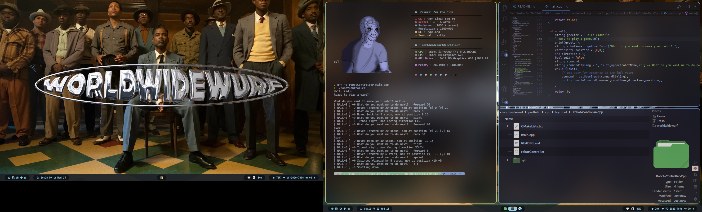

# Robot Controller | C++

## Introduction  
The Robot Controller is a C++ program that simulates a robot's movements based on user commands. The robot can move in different directions and perform various actions.  

### Features  
**Move Commands:** Move the robot forward or backward by a specified number of steps.  
**Turn Commands:** Turn the robot left or right by 90 degrees.  
**Sprint Command:** Sprint forward by a specified number of steps.  
**Shutdown Command:** Shut down the robot.  
**Help Command:** Display information about available commands.  

### Getting Started  

Follow these steps to run the Robot Controller on your device:  

1. Clone the Repo  
```bash
git clone https://github.com/worldwidewurf/Robot-Controller-Cpp.git  
cd Robot-Controller-Cpp  
```

2. Compile  
```bash
g++ -o robotController main.cpp  
```

3. Run  

```bash
./robotController  
```  
  
### Usage  
The Robot Controller accepts the following commands:  
  
**OFF:** Shut down the robot.  
**HELP:** Display information about available commands.  
**FORWARD [steps]:** Move forward by the specified number of steps.  
**BACK [steps]:** Move backward by the specified number of steps.  
**RIGHT:** Turn right by 90 degrees.  
**LEFT:** Turn left by 90 degrees.  
**SPRINT:** Sprint forward by 5 steps.  
  




### Contributing

Feel free to contribute to the project by creating issues or submitting pull requests. Your input is highly appreciated!

